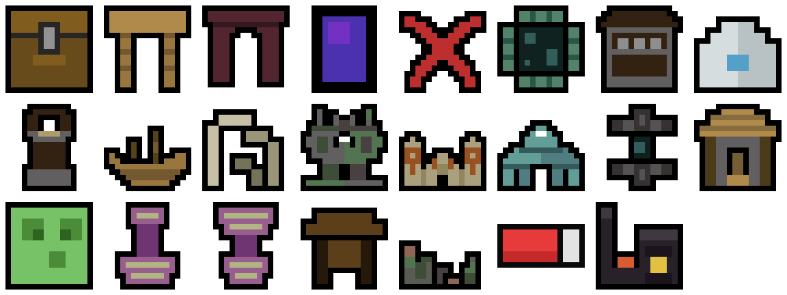
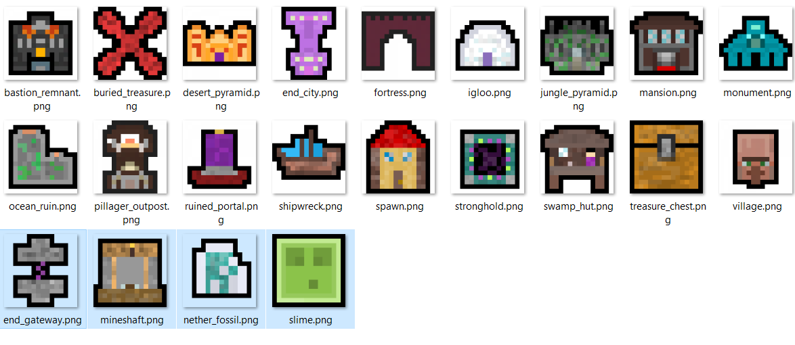

# Minecraft icons

Those are Minecraft icons for structures, features and items.

Flat design icons created by Uniquepotatoes.

Rich design icons by Neil

All the icons are in '/icons' you will find in each set 2 folders, one for features and one for structures.

Released under CC-0

NOT OFFICIAL MINECRAFT PRODUCT. NOT APPROVED BY OR ASSOCIATED WITH MOJANG.
